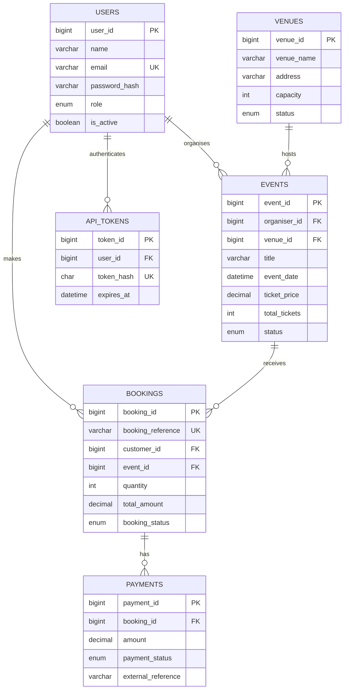

# EventEase ERD

```mermaid
erDiagram
  USERS ||--o{ EVENTS : organises
  USERS ||--o{ BOOKINGS : makes
  VENUES ||--o{ EVENTS : hosts
  EVENTS ||--o{ BOOKINGS : receives
  BOOKINGS ||--o{ PAYMENTS : has
  USERS ||--o{ API_TOKENS : authenticates
  USERS { bigint user_id PK
    varchar name
    varchar email UK
    varchar password_hash
    enum role
    boolean is_active
  }
  VENUES { bigint venue_id PK
    varchar venue_name
    varchar address
    int capacity
    enum status
  }
  EVENTS { bigint event_id PK
    bigint organiser_id FK
    bigint venue_id FK
    varchar title
    datetime event_date
    decimal ticket_price
    int total_tickets
    enum status
  }
  BOOKINGS { bigint booking_id PK
    varchar booking_reference UK
    bigint customer_id FK
    bigint event_id FK
    int quantity
    decimal total_amount
    enum booking_status
  }
  PAYMENTS { bigint payment_id PK
    bigint booking_id FK
    decimal amount
    enum payment_status
    varchar external_reference
  }
  API_TOKENS { bigint token_id PK
    bigint user_id FK
    char token_hash UK
    datetime expires_at
  }
```

Source of truth: `../database/schema.sql`. Render this Mermaid diagram in the report or redraw it in a diagram tool.
